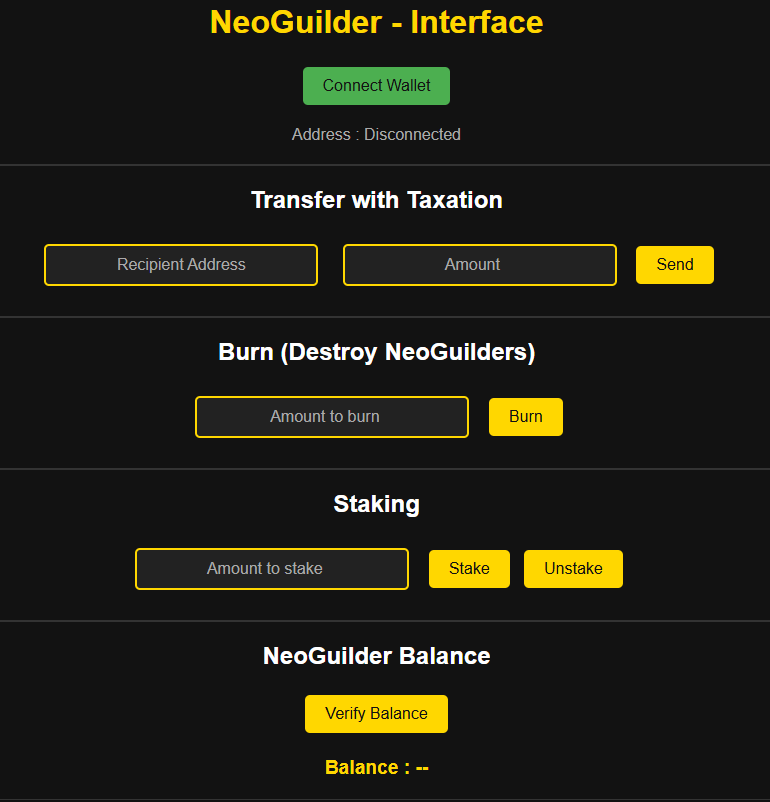
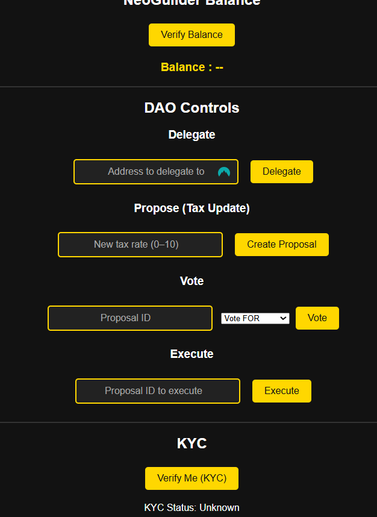

# NeoGuilder V2

**NeoGuilder** is a full-stack Web3 project featuring an ERC-20 token with taxation, staking, and burn logic, paired with a governance DAO (based on OpenZeppelin's Governor), a unique NFT tied to the top holder, a KYC verification system, and a reputation module. It includes a minimal yet functional frontend built with Ethers.js, plus local testing and deployment using Hardhat.

Inspired by the Guilder — the world's first global currency — NeoGuilder was my first complete blockchain project. This V2 is a fully modular, testable, and extensible system built in 3 weeks to explore and integrate advanced Web3 concepts.

---

## 🚀 Features

- ✅ ERC-20 Token with:
  - Transfer Taxation (3% default, DAO-controlled)
  - Staking & Unstaking (with time-based rewards)
  - Burning
  - Top holder tracking (used for NFT assignment)
- ✅ MetaMask Integration (Sepolia Testnet)
- ✅ Frontend (Ethers.js, tested & functional)
- ✅ DAO Governance (`Governor`, `Timelock`, `Quorum`, etc.)
  - Proposal, Vote, Execution flows
  - Delegation support
- ✅ Unique NFT auto-assigned to the top NGD holder
- ✅ KYC Contract (required for proposal submission)
- ✅ Reputation Contract (rewards based on voting power)
- ✅ AutoSustainability Module (redistributes tax shares)
- ✅ Unit Tests (Hardhat)
- ✅ Modular Smart Contract Architecture

---

## 📦 Installation & Setup

### 1️⃣ Prerequisites

Make sure you have the following installed:

- Node.js
- MetaMask
- Hardhat

### 2️⃣ Clone the Repository

git clone https://github.com/DenoyelSeb/NeoGuilder.git
cd NeoGuilder

### 3️⃣ Install Dependencies

npm install

Used dependencies:
ethers
hardhat
dotenv
@openzeppelin/contracts
@openzeppelin/hardhat-upgrades
express
cors

### 4️⃣ Start Local Hardhat Node

npx hardhat node

### 5️⃣ Deploy All Contracts Locally

npx hardhat run scripts/DeployAll.js --network localhost
🔗 Deployment
✅ Deployed on Sepolia Testnet

📍 Contract Addresses (see deployed.json):

NeoGuilder: [TOKEN_ADDRESS]
NeoGuilderDAO: [DAO_ADDRESS]
NeoGuilderNFT: [NFT_ADDRESS]
KYC, Reputation, AutoSustainability, Timelock, etc.

🔍 To verify deployment (example):

npx hardhat verify --network sepolia <CONTRACT_ADDRESS> <constructor_args...>

🧪 Run unit tests:

npx hardhat test

🌐 Frontend Usage

The project includes a lightweight but complete frontend built with Ethers.js.

To use it:
- Connect MetaMask to Sepolia
- Open index.html in your browser
- Use available buttons to:
- Connect wallet
- Stake / Unstake / Burn
- Transfer tokens (with taxation)
- View your balance
- See NFT badge if you're the top holder
- Interact with the DAO: propose, vote, delegate, execute
- Trigger your KYC verification (via DAO admin)

🖼️ Example Interface (Top holder gets the NFT badge):

🧩 Smart Contract Modules
Contract	            Description
NeoGuilder.sol	        ERC-20 token with taxation, staking, burn
NeoGuilderNFT.sol	    ERC-721 NFT assigned to the top NGD holder
NeoGuilderDAO.sol	    Governance with KYC check, reputation, timelock
Reputation.sol	        Tracks and ranks voter reputation (tiered)
KYC.sol	                Simple on-chain whitelist for proposers
AutoSustainability.sol	Redistributes part of taxation to treasury wallet
Timelock.sol	        Used by the DAO to delay proposal execution
FakeDAO.sol	            Helper for bypassing DAO checks in unit tests

🚧 Planned Upgrades
- Ensure full frontend ↔ DAO ↔ KYC integration
- Deploy to Polygon Mainnet
- Add more advanced analytics & NFT logic
- Audit simulation / Slither analysis pass

🤝 Contribution  
This project is not open for contributions at this time.

⚖️ License  
This project is licensed under the **MIT License** – you are free to use, modify, and distribute it, provided you include the original copyright and license.

📢 Notes  
This project was designed as a technical showcase and is not meant for production use.  
Feel free to explore and fork the code for learning purposes.

🚀 Enjoy exploring Web3 with NeoGuilder V2!